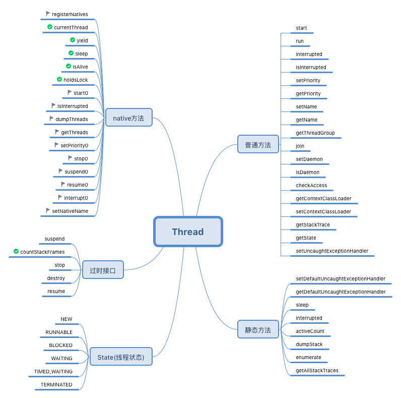
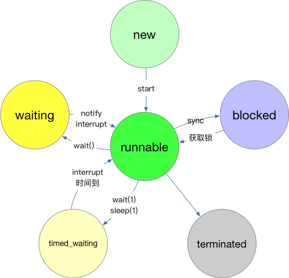
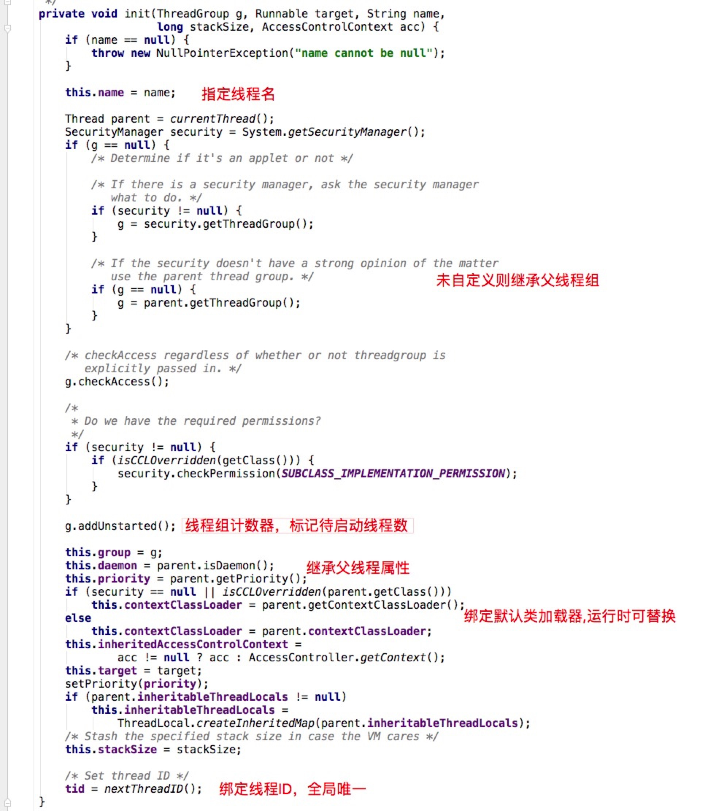
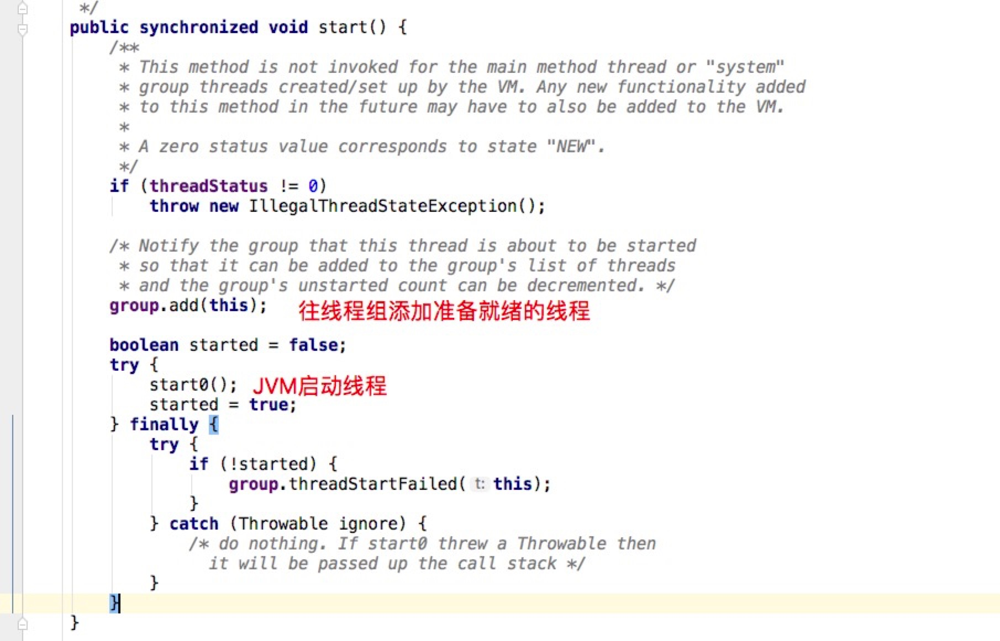
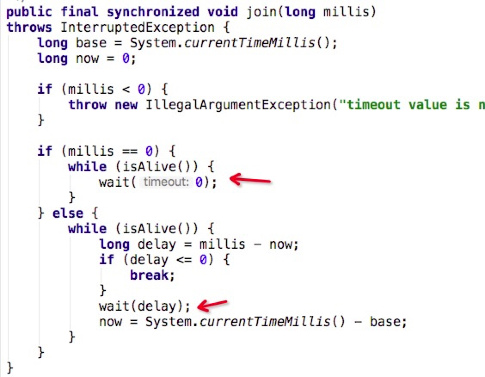

# Thread知多少
线程类Thread是一个非常基础且非常核心的类，所有的的Java项目以及运行进程都跟它有着必然联系。
介绍它的文章不胜枚举，本文将从源码角度对其进行一次深度剖析，或许你会从中了解到自己不曾留意的知识点。



我们将Thread源码中的内容进行了简单规整，大致可分为五大块：
  
- 线程状态
- 过时接口
- native接口
- 静态方法
- 普通方法

## 线程状态


### 新建状态(NEW)
通过`new`操作符创建Thread对象后，如：`new Thread()`，线程便处于该状态。
新建状态下的线程是无法主动执行任务：`run()`方法的。


- 每个线程必然存在关联的父线程和线程组
- 线程优先级不会超过归属线程组优先级（参考setPriority算法）
- 线程初始化阶段很多环节存在同步锁（addUnstarted、nextThreadID、nextThreadNum()），因此实际使用中推荐线程池。

### 就绪状态(Runnable)
可运行线程的线程状态。处于可运行状态的某一线程正在 Java 虚拟机中运行，但它可能正在等待操作系统中的其他资源，比如处理器。


- 多次调用start方法会触发`IllegalThreadStateException`异常

### 阻塞状态(Blocked)
受阻塞并且正在等待监视器锁的某一线程的线程状态。处于受阻塞状态的某一线程正在等待监视器锁，以便进入一个同步的块/方法，或者在调用 Object.wait 之后再次进入同步的块/方法。

### 等待状态(WAITING)
某一等待线程的线程状态。某一线程因为调用下列方法之一而处于等待状态：

- 不带超时值的 Object.wait
- 不带超时值的 Thread.join
- LockSupport.park

处于等待状态的线程正等待另一个线程，以执行特定操作。 例如，已经在某一对象上调用了 Object.wait() 的线程正等待另一个线程，以便在该对象上调用 Object.notify() 或 Object.notifyAll()。已经调用了 Thread.join() 的线程正在等待指定线程终止。

### 限时等待状态(TIMED_WAITING)
具有指定等待时间的某一等待线程的线程状态。某一线程因为调用以下带有指定正等待时间的方法之一而处于定时等待状态：

- Thread.sleep
- 带有超时值的 Object.wait
- 带有超时值的 Thread.join
- LockSupport.parkNanos
- LockSupport.parkUntil

### 死亡状态(TERMINATED)
已终止线程的线程状态。线程已经结束执行。线程结束时JVM会自动调用Thread的私有方法exit以释放资源。


> 使用ThreadLocal若没有主动remove，在线程任务结束后也会执行内存回收。所谓的内存泄露只存在于长时间处于Runnable状态的线程，例如线程池。

### 线程状态代码演示
```java
public class ThreadDemo {
    public static void main(String[] args) throws InterruptedException {
        Thread t = new Thread(new Runnable() {
            @Override
            public void run() {
                Thread currentThread = Thread.currentThread();
                try {
                    System.out.println("sleep 150ms");
                    Thread.sleep(150);
                    System.out.println("sleep 结束");
                } catch (InterruptedException e) {
                    e.printStackTrace();
                }

                synchronized (currentThread) {
                    try {
                        System.out.println("wait线程");
                        currentThread.wait();
                        System.out.println("wait结束");
                    } catch (InterruptedException e) {
                        e.printStackTrace();
                    }
                }
                System.out.println(currentThread.getState());
                System.out.println("执行完成");
            }
        });
        //NEW
        System.out.println("当前线程状态" + t.getState());

        t.start();

        //TIMED_WAITING
        Thread.sleep(100);
        System.out.println("当前线程状态" + t.getState());

        Thread.sleep(200);
        System.out.println("当前线程状态" + t.getState());
        synchronized (t) {
            t.notify();
        }

        Thread.sleep(100);
        System.out.println("当前线程状态" + t.getState());
    }
}

```

## 过时方法
- suspend、resume  
	suspend方法是将一个线程挂起，而resume则是将一个挂起线程复活继续执行，这两个是相互配合的方法。如果这两个方法在某个对象的同步块中执行，会出现死锁。
	
	```java
	public class ThreadDemo1 {
    public static void main(String[] args) {
        //正常情况
        Thread t1 = new Thread(new Runnable() {
            @Override
            public void run() {
                System.out.println("挂起");
                Thread.currentThread().suspend();
                System.out.println("被唤醒了");
            }
        });
        t1.start();
        Thread t2 = new Thread(new Runnable() {
            @Override
            public void run() {
                try {
                    Thread.sleep(100);
                } catch (InterruptedException e) {
                    e.printStackTrace();
                }
                t1.resume();
            }
        });
        t2.start();

        //异常情况
        Object lock = new Object();
        Thread t3 = new Thread(new Runnable() {
            @Override
            public void run() {
                System.out.println("挂起");
                synchronized (lock) {
                    Thread.currentThread().suspend();
                }
                System.out.println("被唤醒了");
            }
        });
        t3.start();
        Thread t4 = new Thread(new Runnable() {
            @Override
            public void run() {
                try {
                    Thread.sleep(100);
                } catch (InterruptedException e) {
                    e.printStackTrace();
                }
                System.out.println("尝试获取对象锁");
                synchronized (lock) {
                    System.out.println("准备resume");
                    t3.resume();
                }
            }
        });
        t4.start();
    }
}
```
- stop	
非常粗暴的停止线程，当前线程可能正在执行关键业务，却被强行终止。

- destory  
	调用该方法会直接异常，想不出设计它的初衷是什么。可能需要看最早期的Java代码才能知道原因。
- countStackFrames  
 计算该线程中的堆栈帧数，需要suspend配合才能使用。
## native方法
- currentThread：返回当前正在执行的线程对象
- yield：暂停当前正在执行的线程对象，并执行其他线程。

	```java
public class TreadDemo3 {
    public static void main(String[] args) {

        for (int i = 0; i < 2; i++) {
            new Thread(new Runnable() {
                @Override
                public void run() {
                    int i = 0;
                    while (i++ < 100) {
                        System.out.println(Thread.currentThread().getName() + ":" + i);
                        Thread.yield();
                    }
                }
            }).start();
        }

    }
}

	```
- sleep：在指定的时长内让当前正在执行的线程休眠（暂停执行），此操作受到系统计时器和调度程序精度和准确性的影响。该线程不丢失任何监视器的所属权（持有CPU资源）。
- isAlive：so easy!
- holdsLock：如果当前线程在指定的对象上保持监视器锁，则返回 true

	```java
public class ThreadDemo4 {
    public static void main(String[] args) {
        Object object=new Object();
        System.out.println(Thread.holdsLock(object));
        synchronized (object){
            System.out.println(Thread.holdsLock(object));
        }
        System.out.println(Thread.holdsLock(object));
    }
}
	```
- isInterrupted
- dumpThreads：将当前线程的堆栈跟踪打印至标准错误流，就是new了一个异常对象再执行`printStackTrace()`。
- getThreads：反馈当前进程内的所有活动线程，被`getAllStackTraces()`调用。
- setPriority0：将线程优先级设置到操作系统层面。
- setNativeName：将线程名称注册到操作系统层面。


## 静态方法
略，基本没啥好讲的

## 普通方法
- interrupt  
	中断线程。如果线程在调用 Object 类的 wait()、wait(long) 或 wait(long, int) 方法，或者该类的 join()、join(long)、join(long, int)、sleep(long) 或 sleep(long, int) 方法过程中受阻，则其中断状态将被清除，它还将收到一个 InterruptedException。
	
	```java
	public class ThreadDemo5 {
    public static void main(String[] args) throws InterruptedException {
        Object lock = new Object();
        Thread t = new Thread(new Runnable() {
            @Override
            public void run() {
                try {
                    Thread.sleep(1000);
                } catch (InterruptedException e) {
                    e.printStackTrace();
                }
                synchronized (lock) {
                    try {
                        lock.wait();
                    } catch (InterruptedException e) {
                        e.printStackTrace();
                    }
                }
            }
        });
        t.start();

        Thread.sleep(100);
        t.interrupt();
        System.out.println("中断t的sleep");
        Thread.sleep(100);
        t.interrupt();
        System.out.println("中断t的wait");
    }
}
	```
	
- join：等待该线程终止。

通过wait接口来实现join功能。如下代码所示当线程t2执行`t1.join()`后，t2线程阻塞，待t1线程执行完毕后JVM会通过notifyAll来唤醒t2线程。

	```java
public class ThreadDemo6 {
    public static void main(String[] args) {
        Thread t1 = new Thread(new Runnable() {
            @Override
            public void run() {
                try {
                    Thread.sleep(100);
                } catch (InterruptedException e) {
                    e.printStackTrace();
                }
                System.out.println("thread 1");
            }
        });

        Thread t2 = new Thread(new Runnable() {
            @Override
            public void run() {
                try {
                    t1.join();
                } catch (InterruptedException e) {
                    e.printStackTrace();
                }
                System.out.println("thread 2");
            }
        });
        t1.start();
        t2.start();
    }
}
```
- setDaemon  
	将该线程标记为守护线程或用户线程。当正在运行的线程都是守护线程时，Java 虚拟机退出。该方法必须在启动线程前调用。
- setContextClassLoader		
	返回该线程的上下文 ClassLoader。上下文 ClassLoader 由线程创建者提供，供运行于该线程中的代码在加载类和资源时使用。如果未设定，则默认为父线程的 ClassLoader 上下文。原始线程的上下文 ClassLoader 通常设定为用于加载应用程序的类加载器
	
- getContextClassLoader		
设置该线程的上下文 ClassLoader。上下文 ClassLoader 可以在创建线程设置，并允许创建者在加载类和资源时向该线程中运行的代码提供适当的类加载器。

> 涉及到类加载或隔离的项目通常会重置线程中的classLoader.

**还有一些边边角角的方法自己去看源码。**