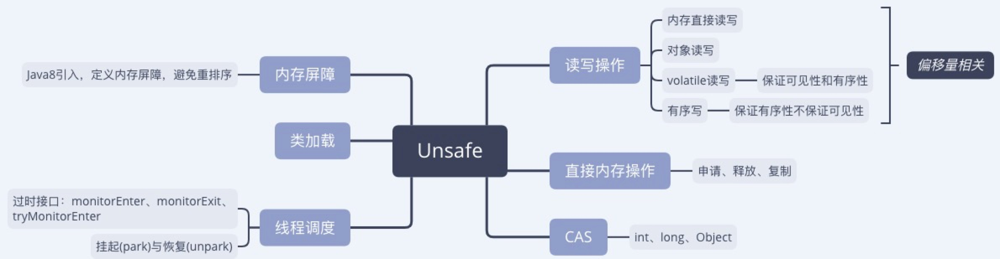

#Unsafe详解

##什么是Unsafe
>A collection of methods for performing low-level, unsafe operations. Although the class and all methods are public, use of this class is limited because only trusted code can obtain instances of it

> 用于执行低级别，不安全操作的方法的集合。虽然Unsafe提供的类和所有方法都是公共的，但是只有受信任的代码才能获得它的实例并使用它。

如何理解：只有受信任的代码才能获得他的实例？尽管Unsafe没有提供public的构造方法，但是却有一个`getUnsafe`的静态公有方法。
如果你觉得可以通过`Unsafe.getUnsafe()`获得它的实例，那就太天真了。一旦执行该方法便会在抛如下异常：
```
Exception in thread "main" java.lang.SecurityException: Unsafe
	at sun.misc.Unsafe.getUnsafe(Unsafe.java:90)
	at UnsafeDemo.main(UnsafeDemo.java:9)
```
之所以异常是由于Unsafe只信任由引导类加载器（Boostrap classBloader）加载的类，凡是由系统类加载器加载的class试图调用`getUnsafe`便会异常。

单纯的通过Unsafe这个名字便可知晓这个类不安全，官方并不推荐使用也几乎没提供文档。
本地通过反编译也只能看到大量的native方法，即便从openJdk上下载了源码也会发现源码与反编译的代码几乎无差，没有注释，只有冷冰冰的代码。

Unsafe提供的最关键能力便是可以直接操作内存，有点类似C语言的指针。使用这个类相当于玩游戏开了作弊器，为程序员预留了很大的发挥空间，
然而这种能力一旦驾驭不好便极容易出问题，所以`Unsafe`的名称并不代表这个类本身不安全，而是提醒使用它的开发人员，没有能力就离它远远的，不要玩火自焚。

### 实例化
既然Unsafe默认不能被它非信任的代码调用，我们只能另辟蹊径来绕过其限制。通过源码我们会看到`Unsafe`内部有一个静态的成员变量`theUnsafe`,这个成员变量的类型不仅是`Unsafe`而且在类加载后便完成了实例化。
所以我们只需拿到`theUnsafe`便获得了`Unsafe`类的对象。虽然Java关上了`Unsafe.getUnsafe()`这扇门，但还是为我们开了一扇窗：反射。
```java
public class UnsafeDemo {
    public static void main(String[] args) {
        Unsafe unsafe=getUnsafe();
        System.out.println(unsafe);
    }
    private static Unsafe getUnsafe(){
        try {
            Field field = Unsafe.class.getDeclaredField("theUnsafe");
            field.setAccessible(true);
            Unsafe unsafe = (Usafe) field.get(null);
            return unsafe;
        } catch (Exception e) {
            e.printStackTrace();
        }
        return null;
    }
}
```

## 谁在用Unsafe
尽管官方不推荐使用Unsafe，但Java本身在大量使用，尤其是juc包，各项高级接口都是基于Unsafe实现的。

并且在开源项目中号称高性能的也都有Unsafe的身影，比如Netty、Kafka、Hadoop等。
## 怎么用Unsafe
Unsafe提供了85个`public native`以及数十个基于native封装的方法，经过简单归类后如下图所示。

首先我们定义各类`Student`用以之后演示`Unsafe`的各API使用。
```java
public class Student {
    private String name;
    private int age;

    public Student(String name, int age) {
        this.name = name;
        this.age = age;
    }

    public String getName() {
        return name;
    }

    public void setName(String name) {
        this.name = name;
    }

    public int getAge() {
        return age;
    }

    public void setAge(int age) {
        this.age = age;
    }
}
```

### 读写操作
读写又可细分为三类：内地直接读写、对象读写、volatile 读写、有序写，并各有一批见名知意的接口与之类别相对应。

- 内存直接读写
    ```java
    /**
     * 从给定的内存地址中获取值。 
     * 如果地址为零，或者没有指向通过allocateMemory申请的内存块，则结果是未定义的。
     *
     * @see #allocateMemory
     */
    public native byte    getByte(long address);

    /**
     * 将值存储到给定的内存地址中。 
     * 如果地址为零，或者没有指向通过allocateMemory申请的内存块，则结果是未定义的。
     *
     * @see #getByte(long)
     */
    public native void    putByte(long address, byte x);
    public native short   getShort(long address);
    public native void    putShort(long address, short x);
    public native char    getChar(long address);
    public native void    putChar(long address, char x);
    public native int     getInt(long address);
    public native void    putInt(long address, int x);
    public native long    getLong(long address);
    public native void    putLong(long address, long x);
    public native float   getFloat(long address);
    public native void    putFloat(long address, float x);
    public native double  getDouble(long address);
    public native void    putDouble(long address, double x);
    ```
- 对象读写
  
- volatile 读写
    ```java
    /**
     * Fetches a reference value from a given Java variable, with volatile
     * load semantics. Otherwise identical to {@link #getObject(Object, long)}
     */
    public native Object getObjectVolatile(Object o, long offset);

    /**
     * Stores a reference value into a given Java variable, with
     * volatile store semantics. Otherwise identical to {@link #putObject(Object, long, Object)}
     */
    public native void    putObjectVolatile(Object o, long offset, Object x);
    public native int     getIntVolatile(Object o, long offset);
    public native void    putIntVolatile(Object o, long offset, int x);
    public native boolean getBooleanVolatile(Object o, long offset);
    public native void    putBooleanVolatile(Object o, long offset, boolean x);
    public native byte    getByteVolatile(Object o, long offset);
    public native void    putByteVolatile(Object o, long offset, byte x);
    public native short   getShortVolatile(Object o, long offset);
    public native void    putShortVolatile(Object o, long offset, short x);
    public native char    getCharVolatile(Object o, long offset);
    public native void    putCharVolatile(Object o, long offset, char x);
    public native long    getLongVolatile(Object o, long offset);
    public native void    putLongVolatile(Object o, long offset, long x);
    public native float   getFloatVolatile(Object o, long offset);
    public native void    putFloatVolatile(Object o, long offset, float x);
    public native double  getDoubleVolatile(Object o, long offset);
    public native void    putDoubleVolatile(Object o, long offset, double x);
    ```
- 有序写
    ```java
    /**
     * Version of {@link #putObjectVolatile(Object, long, Object)}
     * that does not guarantee immediate visibility of the store to
     * other threads. This method is generally only useful if the
     * underlying field is a Java volatile (or if an array cell, one
     * that is otherwise only accessed using volatile accesses).
     */
    public native void    putOrderedObject(Object o, long offset, Object x);

    /** Ordered/Lazy version of {@link #putIntVolatile(Object, long, int)}  */
    public native void    putOrderedInt(Object o, long offset, int x);

    /** Ordered/Lazy version of {@link #putLongVolatile(Object, long, long)} */
    public native void    putOrderedLong(Object o, long offset, long x);
    ```

### 内存操作

### CAS

### 线程调度

### 类加载

### 内存屏障